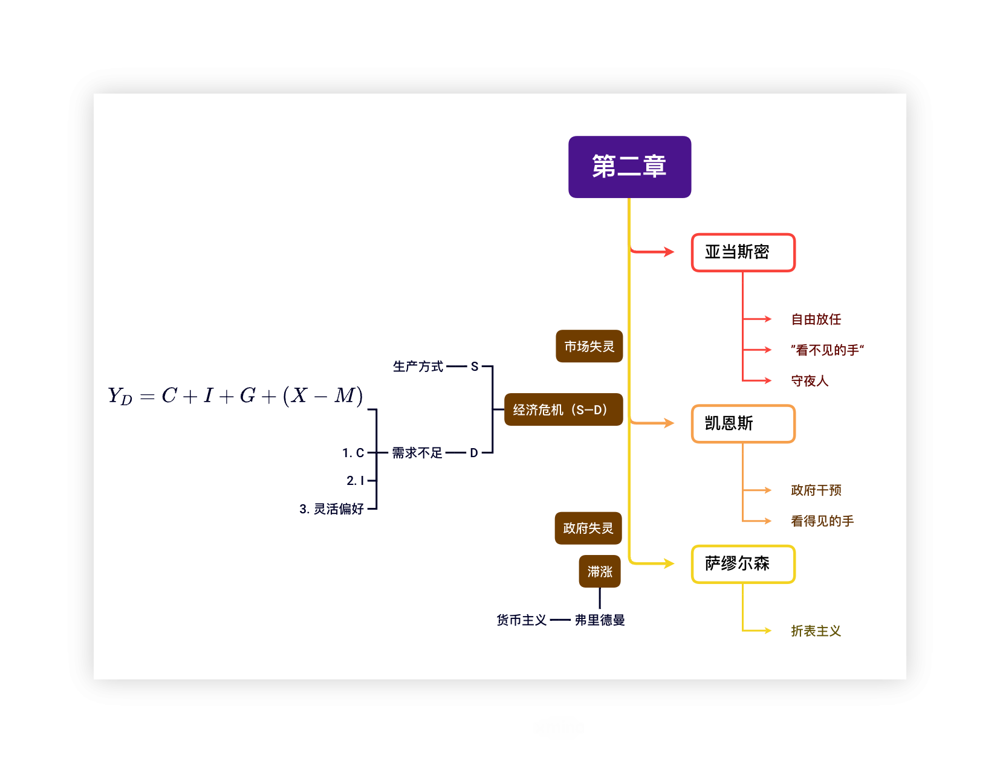
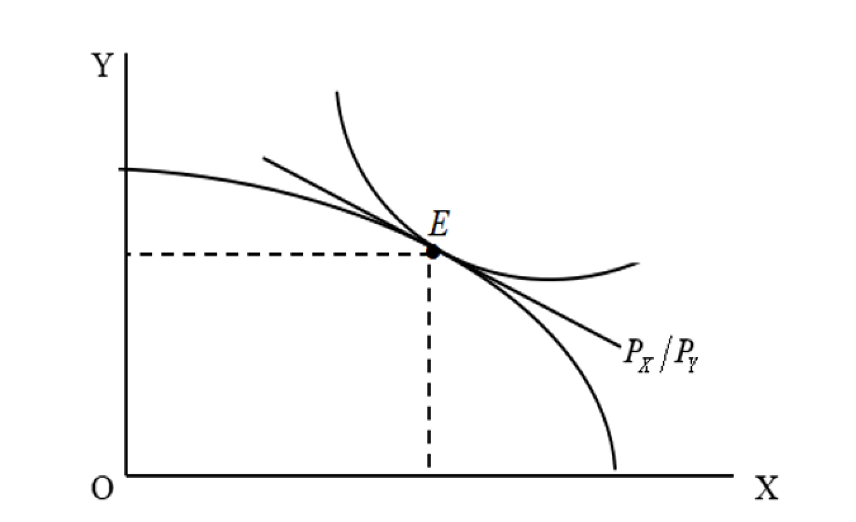
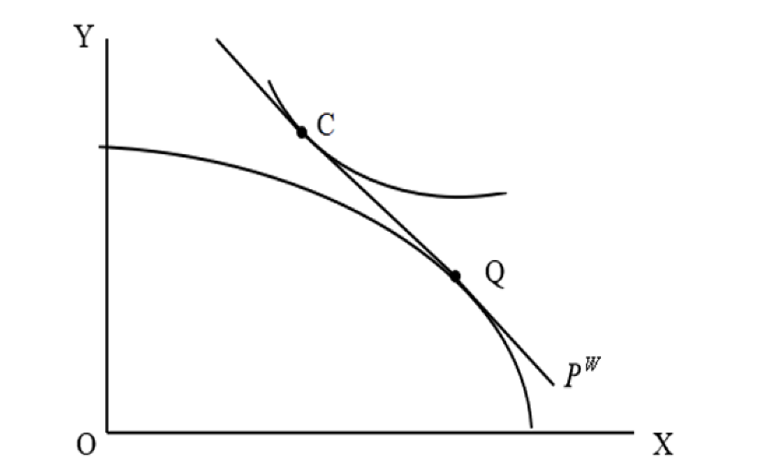
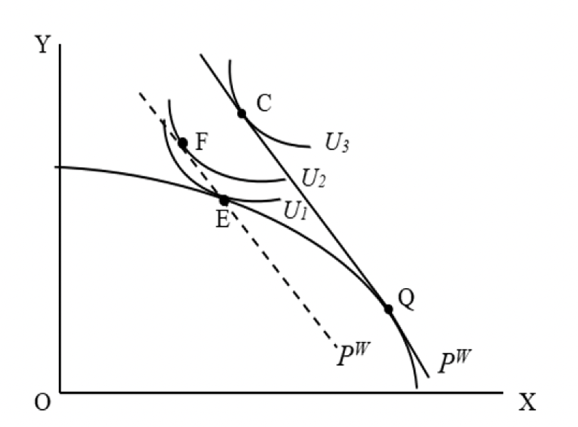

## 国际贸易理论的微观基础

### 国际贸易理论的研究方法与分析工具

#### 货币幻觉

“货币幻觉”一词是美国经济学家[欧文·费雪](https://baike.baidu.com/item/%E6%AC%A7%E6%96%87%C2%B7%E8%B4%B9%E9%9B%AA/9127963?fromModule=lemma_inlink)(IrvingFisher)于1928年提出来的，是货币政策的通货膨胀效应。它是指人们只是对货币的名义价值做出反应，而忽视其实际购买力变化的一种心理错觉。

#### 生产可能性曲线（PPF）

它是指在一定的技术条件下，充分利用一国全部资源所能生产的两种产品的最大产量组合的轨迹。
- 生产可能性边界右移代表经济增长和技术进步

$$经济增长\begin{cases}集约式增长&\text{(内涵式)}\\外延式增长&\text{(粗放)}\end{cases}$$

- 机会成本：$OC=-\frac{\Delta Y}{\Delta X}$
- 变动的三种情形：递增、不变、递减
#### 社会无差异曲线

前提：消费者偏好相同，收入$I$既定
相对位置：偏好
均衡：$MRS_{XY}=\frac{MU_X}{MU_Y}=\frac{P_X}{P_Y}$
社会无差异曲线上的每一个点的斜率定义为边际替代率($MRS$)
用途：
1. 用来确定一国的消费均衡点。
2. 用来衡量社会的福利水平。

### 一般均衡分析
#### 封闭条件下的一般均衡
条件：
    1. 生产均衡$OC=\frac{P_X}{P_y}$
    2. 消费均衡$MRS=\frac{P_X}{P_y}$
    3. 市场出清
国民供给曲线（National Supply Curve）「NS」
国民需求曲线（National Demand Curve）「ND」
贸易条件：价格差

#### 开放条件下的一般均衡

条件：
    1. 生产均衡，即$OC=\frac{P^W_X}{P^W_y}$
    2. 消费均衡，即$MRS=\frac{P^W_X}{P^W_y}$
    3. 贸易平衡，即$P^W_X(X_P-X_C)=P^W_Y(Y_C-Y_P)$

>国际均衡价格$P^W$,这个新的价格一定介于两国原来的国内相对价格之间，即$P^A< P^W< P^B$

### 贸易的起因

#### 完全竞争条件下贸易的起因

1. 要素
2. 技术—劳动生产力
3. 需求偏好
4. 规模经济
5. 市场结构
$P=MC$

#### 不完全竞争条件下贸易的起因
$P>MC$

### 贸易利益

#### 贸易条件

$P^W$，即出口价格与进口价格之比
#### 贸易利益的分解

- 当一国由封闭走向开放，面对新的国际价格时，生产者不能立即调整其生产数量，所以生产点不变。
- $U_1到U_2$该国社会福利水平提高，这是在生产不变的情况下，从国际交换中获得的利益
- $U_2到U_3$其代表的福利水平再次得到提高，这是由生产的专业化而带来的额外利益。