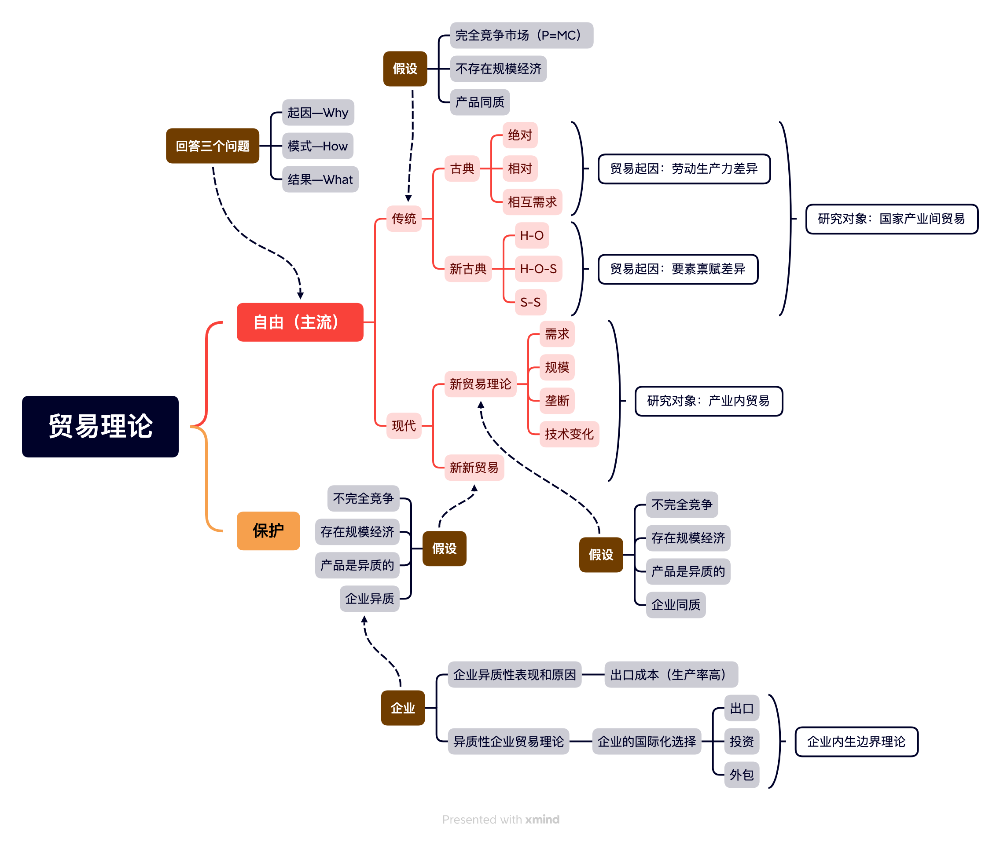
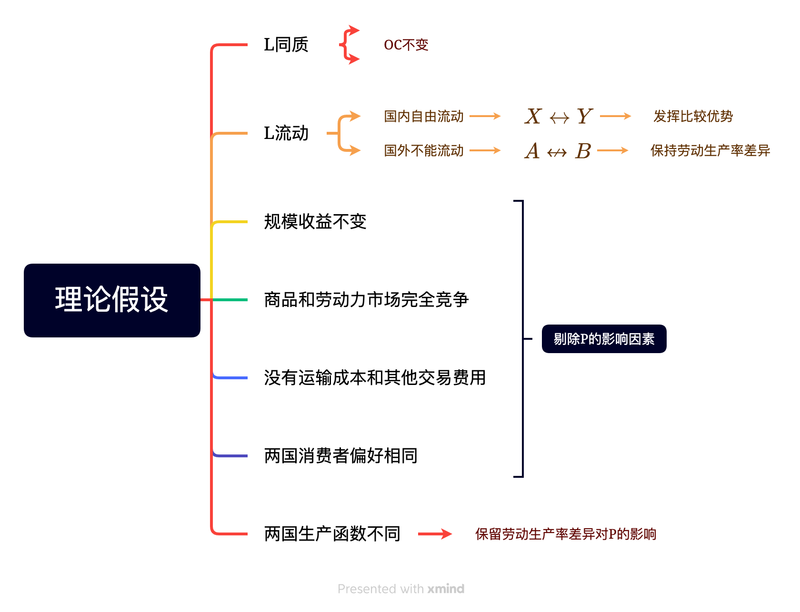
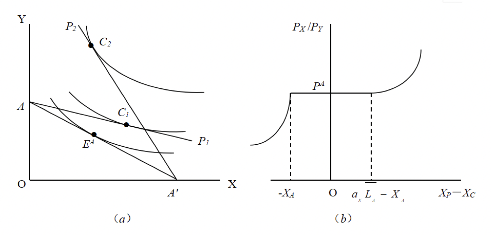
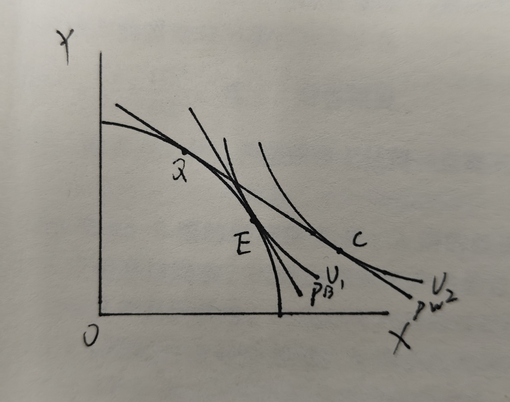

## 古典国际贸易理论
- 劳动生产率差异

### 绝对优势理论

#### 内容

- 对重商主义的批判
1. 分工可以提高劳动生产率
2. 分工的原则是绝对优势
3. 有利地自然禀赋或后天条件
>这表明，国际贸易是一种正和博弈，而非重商主义者所信奉的国际贸易是零和博弈。

#### 局限性

>这一理论本身有一定的局限性，它不能解释贸易的全部，而只说明了国际贸易中的一种特殊情形，即每个国家都具有各自的绝对优势。

### 比较优势理论

#### 理论假设

#### 比较优势理论的现代经济学分析

- 由于假定生产中只使用劳动一种要素，且劳动是同质的，因此机会成本是固定不变的，生产可能性边界是直线型的

$$Y=-\frac{a_Y}{a_X}X+a_Y\times \overline{L}_A$$

1. $P^W_0=P_A=X_P\in[0,a_x\overline{L}_A]$，$X_C=X_A$，$(X_P-X_C)\in[-X_A,a_x\overline{L}_A-X_A]$
2. $P^W<P_A\Rightarrow$多生产Y，少生产X$\Rightarrow$$报酬_Y>报酬_X\Rightarrow L_X\rightarrow L_Y\Rightarrow完全专业化生产Y$；
    - 表示Y的相对劳动生产率$\frac{a_Y}{a_X}$降低，表明Y的相对价格变高(下同)
3.  $P^W>P_A\Rightarrow$多生产X，少生产Y$\Rightarrow$$报酬_X>报酬_Y\Rightarrow L_Y\rightarrow L_X\Rightarrow完全专业化生产X$

### 相互需求理论
#### 贸易利益的分配

- 贸易利益的分配决定于具体的国际交换比例（贸易条件）
- 国际交换比例越接近于本国国内交换比例，对本国越不利，贸易利益越少。

$$P^B>P^W\Rightarrow U_1\Rightarrow U_2$$

TOT（Terms of Trade）[贸易条件](https://wiki.mbalib.com/wiki/Terms_of_Trade)：$TOT=\frac{P_X}{P_M}=\frac{export}{import}$
A：出口X，进口Y
改善：U增加
恶化：U下降
