## 新古典贸易理论
- 要素禀赋差异
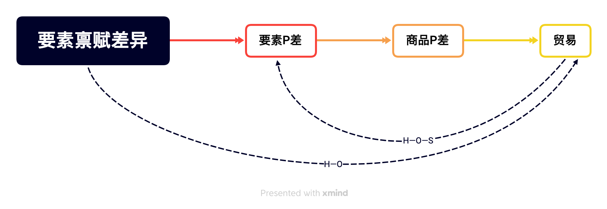

### 要素禀赋理论(H-O理论)

#### 要素密集度

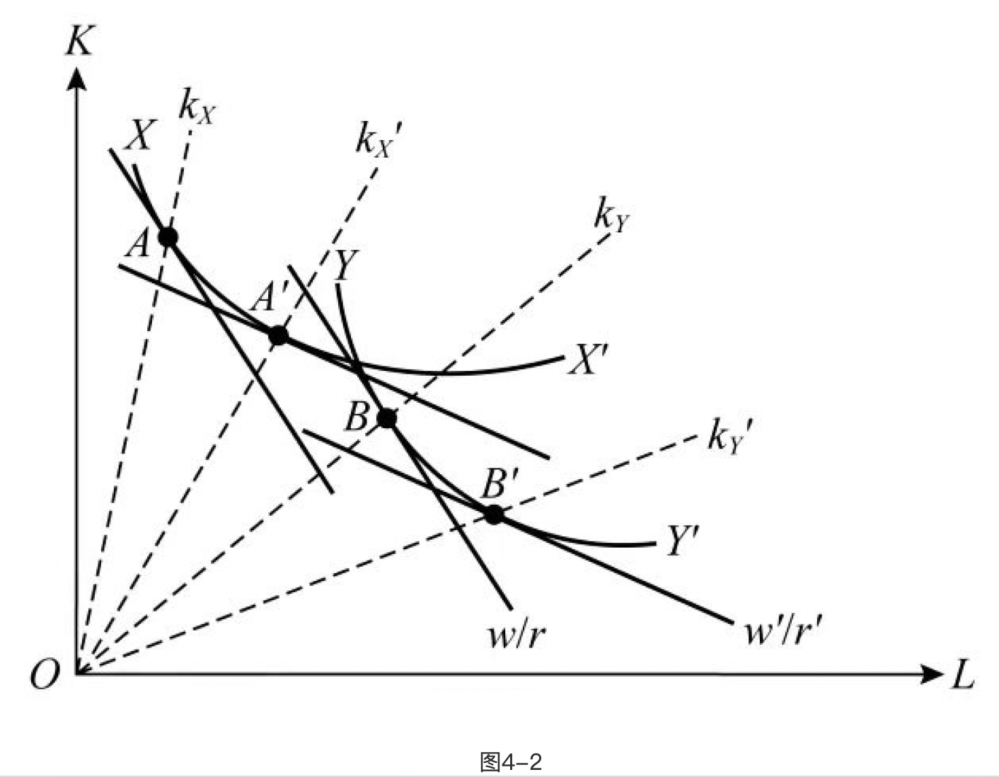

1. $XX'、YY'$是等产量曲线
2. $XX'$更偏向于K轴，$YY'$更偏向于L轴
3. 斜率为要素价格比的线与两条等产量线相切
4. $k_X>k_Y,k_X'>k_Y'$
5. X是资本密集型产品，Y是劳动密集型产品。
>要素密集度：是指在最优的生产要素组合下，生产某种产品所投入的两种生产要素的相对比例。这也是一个相对概念，与生产要素的绝对投入量无关。

#### 模型基本假设

1. 生产要素在一国内自由流动——发挥比较优势
2. 生产要素在国家间不能流动——要素禀赋差异
3. 剔除P的影响因素
4. 生产函数相同——剔除劳动生产率对P的影响
5. $2\times2\times2$模型

#### 主要内容

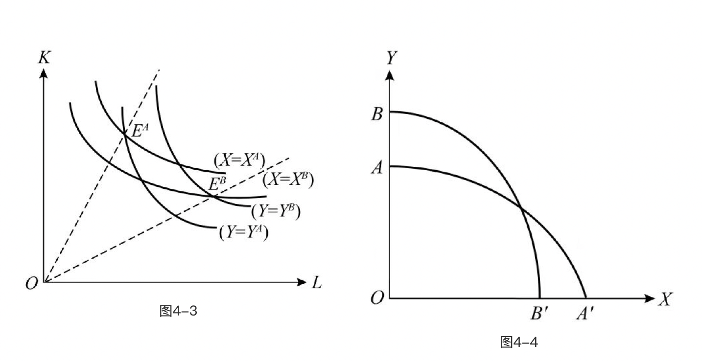

1. $X=X^A$为国投入全部要素生产X的等产量曲线，下同
- 结论：资本丰裕的国家在资本密集型产品上相对供给能力较强，劳动丰裕的国家在劳动密集型产品上相对供给能力较强。

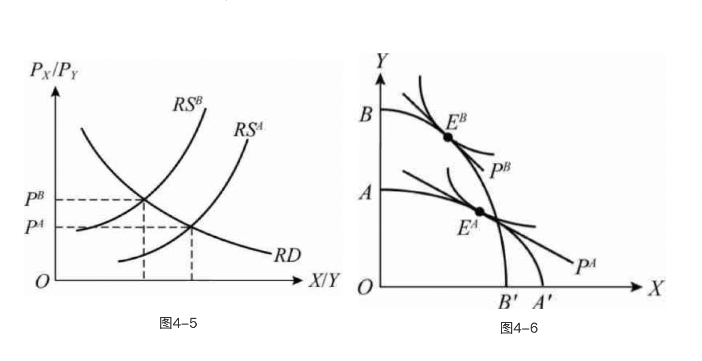
1. RS曲线代表相对供给曲线
2. RD曲线之取决于价格，与收入无关（偏好相同）
3. A国在X产品上相对供给能力更高，相对价格更低，即$P^A<P^B$
4. 反映在图4-6则为，斜率更小，相对价格线更平，B国则相反

- 资本丰裕国家在资本密集型产品上具有比较优势，劳动丰裕国家在劳动密集型产品上具有比较优势。

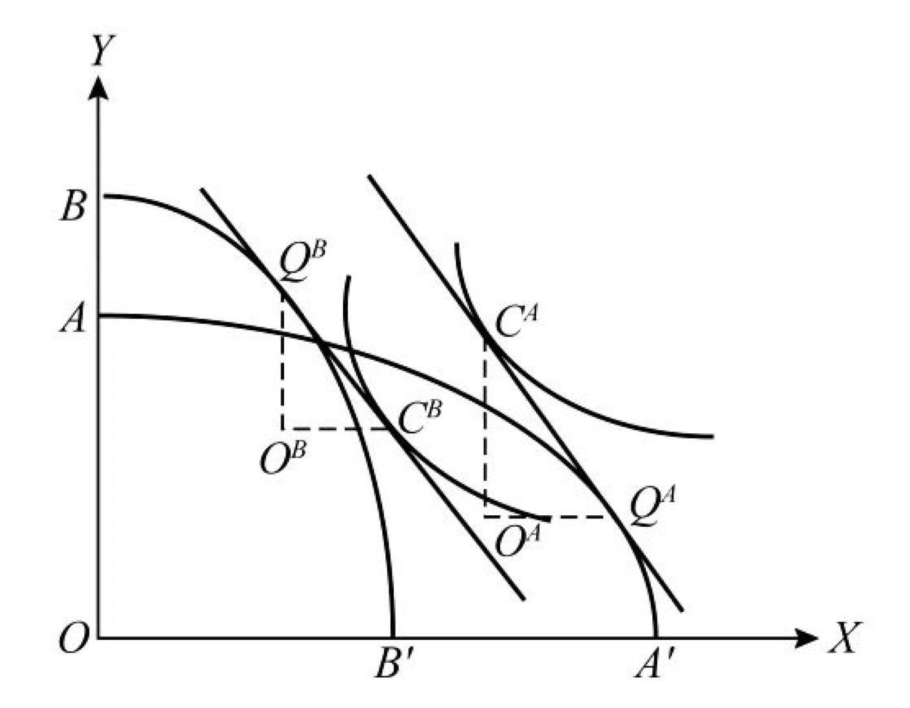
- H-O理论：一国出口密集使用其丰富要素生产的产品，进口密集使用其稀缺要素生产的产品。

### 要素均等化定理(H-O-S)
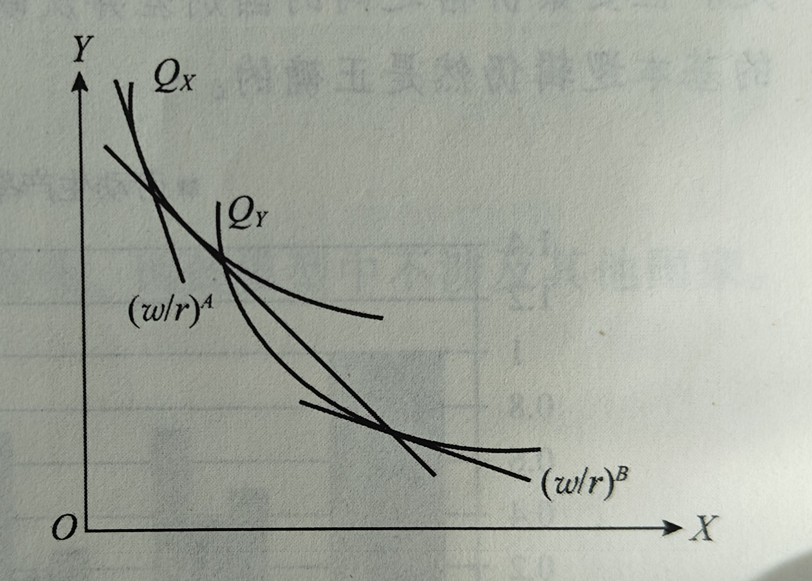
#### 内容
- 两国开展贸易后，对本国丰裕要素的需求随出口而增长，在供给不变的情况下，需求的增长将改变要素的相对价格，从而两国要素的相对价格差异不断缩小直至相等为止，即两国的等成本线重合。
>在现实中，各国的同质要素价格并不一致，原因是H-O理论的假设条件大多在现实经济中不成立。
1. 技术差异
2. 运输成本和贸易壁垒
3. 企业处于不完全竞争市场且多数为规模报酬递增的生产模式

### 斯托尔帕—萨缪尔森定理（SS定理）「长期」

- 边际产品价值：在完全竞争条件下，厂商使用要素的原则是要素在每一部门的报酬等于要素的边际产品价值（VMP，商品价格与边际产出的乘积），即$VMP=P\times MP$
- 某一商品相对价格上升，将导致该商品密集使用的生产要素的实际价格或报酬提高，而另一种生产要素的实际价格或报酬下降。
- 国际贸易会提高该国丰裕要素所有者的实际收入，降低稀缺要素所有者的实际收入。
- 因此，贸易虽然整体上改善了一国福利，但并非对每个人都有利。

### 特定要素模型 specific factor（SF）「短期」

- 特定要素：（Specific Factor）是指用途仅限于某一部门，不适合于其他部门需要的一种要素。
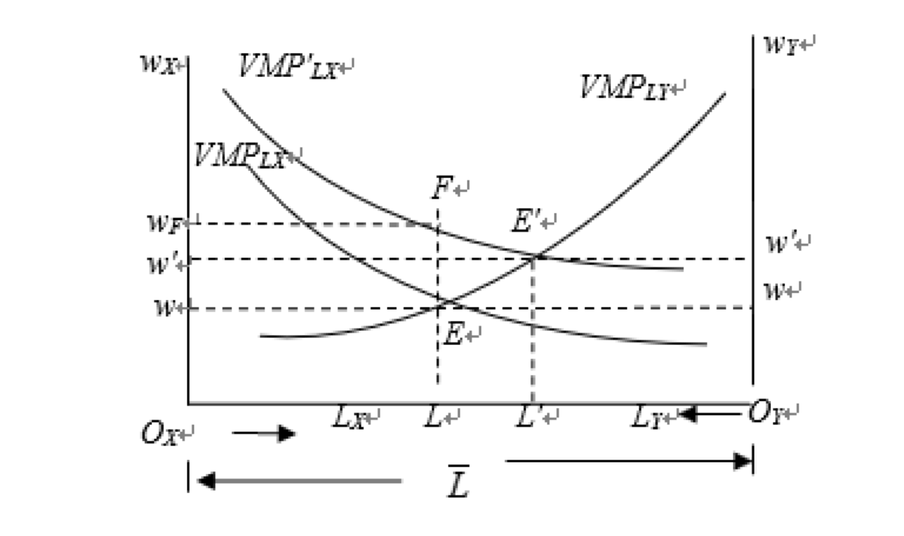
- 边际产出递减规律
    用于描述在特定条件下,随着投入的增加, 产出的增加逐渐减少的现象。
- 边际报酬递减规律
    在任何一种产品的短期生产中,随着一种可变要素投入量的增加,边际产量最终必然会呈现出递减的特征。
结论：
    贸易会提高贸易国出口部门特定要素的实际收入，降低进口相竞争部门特定要素的实际收入；对可自由流动要素的实际收入的影响则不确定，主要取决于要素所有者的消费结构，即取决于劳动者的消费偏好。

### 罗布津斯基定理

#### 假设

- 该定理的假设前提基本与H-O定理保持一致，并且假定商品相对价格保持不变。根据前节的分析，当商品相对价格不变时，要素相对价格也会保持不变，因而两个部门生产中的要素投入比例也不发生变化。唯一不同的是假设一国资本供给数量因为某种原因增加了△K，而劳动力数量不变。
#### 内容

- 罗布津斯基定理：在商品相对价格不变的前提下，某一要素的增加将会导致密集使用该要素部门的生产规模扩大，而密集使用另一要素的部门的生产规模缩小。

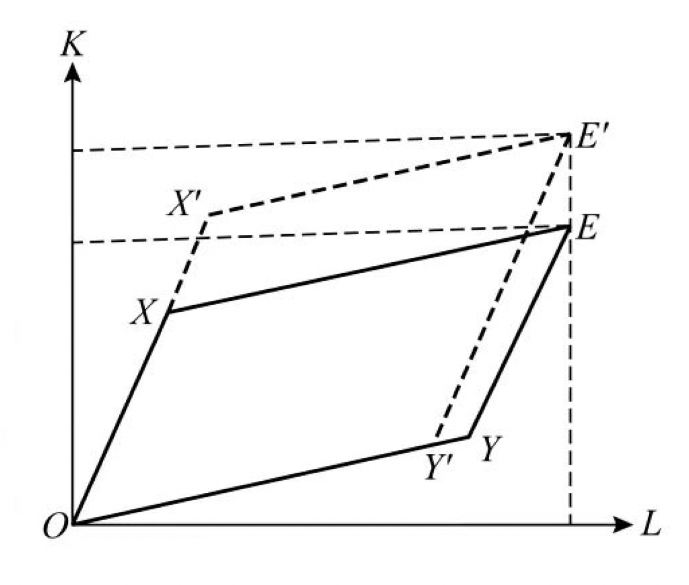
- OX、OY直线的斜率分别表示均衡时两个部门的要素投入比例
- 线段OX、OY表示两个部门的产出水平。

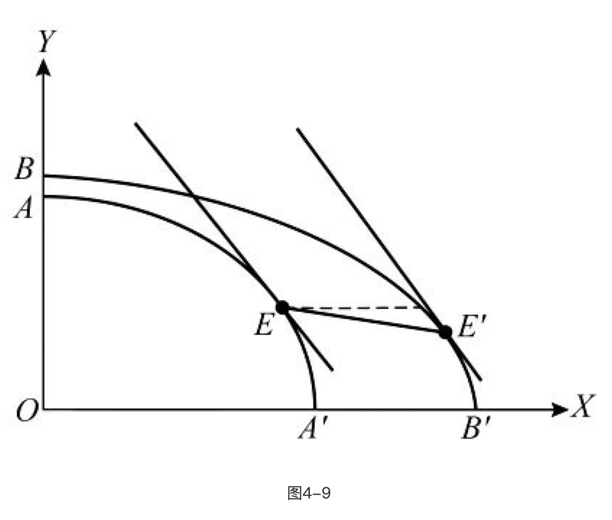
- 通过比较可以看出，E′点位于E点的右下方，表明资本密集型的X产品的产量增加了，而劳动密集型的Y产品的产量则下降。因此，我们把直线EE′称之为罗布津斯基线（Rybczynski Line）。
#### 罗布津斯基定理的政策含义:

1. 享有资本存量相对增加的国家，应该预期到他们的劳动要素密集型工业的规模将会趋于收缩；
2. 对于劳动要素供给趋于增加的国家，不适宜地发展技术与资本要素密集型的工业，则可能导致比较优势的丧失；
3. 一个国家的比较优势不是一成不变的。

#### 荷兰病

荷兰病(the Dutch disease)，是指一国特别是指中小国家经济的某一初级产品部门异常繁荣而导致其他部门的衰落的现象。因为发现沿海地区蕴藏巨量天然气，荷兰在20世纪50年代迅速成为了以出口天然气为主业的国家。天然气的大量出口引起国际收支顺差，经济繁荣。可是荷兰的农业、工业部门却开始萎缩，同时本币升值，出口产品竞争力下降。到了70年代，荷兰出现通货膨胀、制成品出口下降、收入增长率降低、失业率增加等经济失衡的现象，被称为“荷兰病”。

自我国开展西部大开发的战略以来，我国中西部地区对各自的自然资源的储备的开采带动了当地经济的快速进展。其对于经济进展的模式和经济结构的调整产生的巨大的影响，其中最为显著的问题就是“荷兰病”。对地区经济结构产生了巨大的影响，

我国有很多因资源而兴起的城市，比如石油之城大庆、煤炭之城大同。历史上，这些资源型城市虽然由小到大走向繁荣，但由于过于依赖资源优势，导致经济构成单一，当资源变少、枯竭时，以及资源价格开始国际性下行时，危机也开始产生。内蒙古有大量的、丰富的自然资源，其煤炭资源储量已是全国煤炭储量之最，羊绒、稀土、天然气等自然资源储量也在全国自然资源储量中占据了很大一部分。内蒙古丰富的自然资源储量推动了经济发展，得天独厚的煤炭资源保障了工业的繁荣，2020年地区生产总值完成17 359.8亿元，按可比价计算，比上年增长0.2%。其中，第一产业增加值2025.1亿元，增长1.7%;第二产业增加值6868.0亿元，增长1.0%;第三产业增加值8466.7亿元，下降0.9%。三次产业比例为11.7:39.6:48.8。近年来，内蒙古对与煤炭有关行业加大力度整顿，将不可再生资源进行加工、生产，以及将煤炭发电等生产行业作为行业发展重中之重，这使得生产模式简洁、产业结构单一，不可再生资源的滥用，终将成为“荷兰病”的病源。

### 贫困化增长

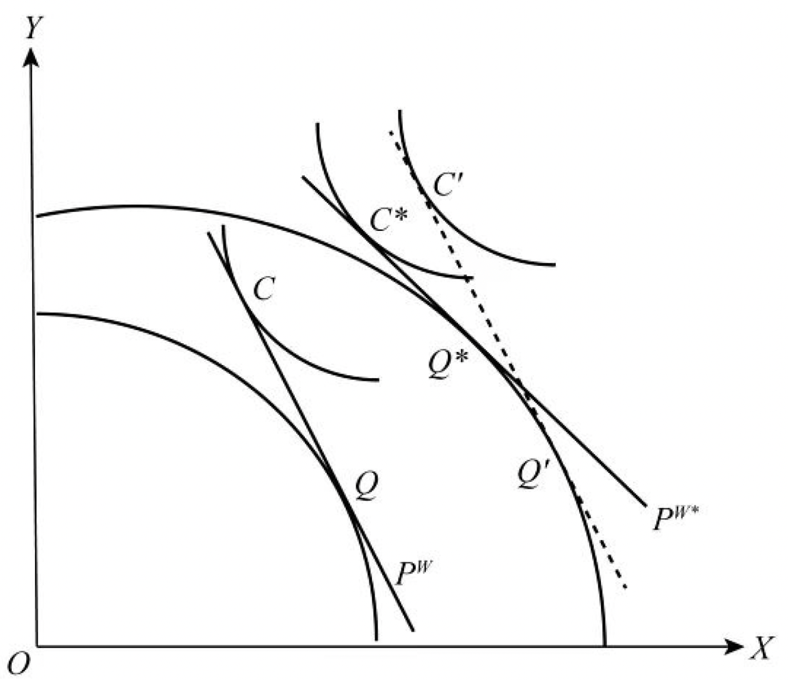

- 小国
- 大国
- 顺贸易增长与贸易变动
    

- 贫困化增长：出口大国的顺贸易型增长使其贸易条件严重恶化，造成的福利损失超过经济增长带来的福利，出现福利的净下降。

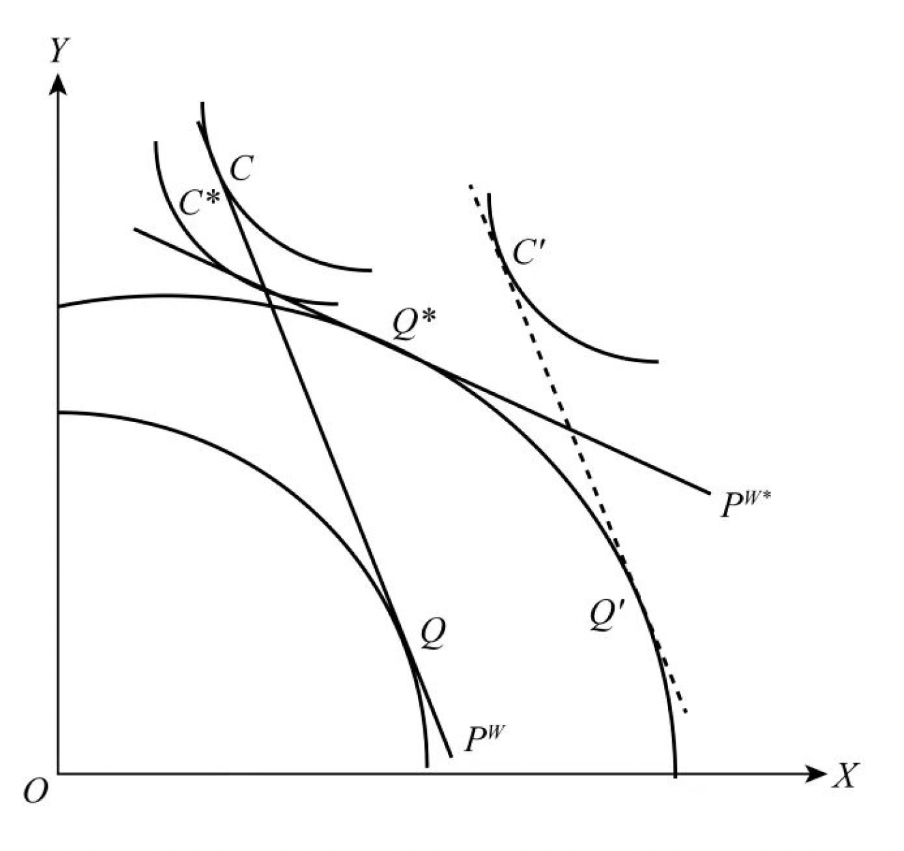
1. 该国是一个贸易大国，因为只有贸易大国的进出口数量变化才会影响世界商品价格；
2. 经济增长偏向于出口部门，且增长较快；
3. 国际市场对该出口商品的需求缺乏弹性，以致出口供给的扩大导致出口价格的迅速下跌；
4. 该国对贸易的依赖度很强，以至于贸易条件的恶化将引起国家福利的下降

$$AB\rightarrow A'B'\Rightarrow P\rightarrow P'\Rightarrow U\rightarrow U'$$

$$顺贸易增长\Rightarrow TOT变化\Rightarrow 福利下降$$

悲惨增长的本质是经济增长后，价格贸易条件、收入贸易条件以及要素贸易条件的全面恶化，从而造成福利水平的下降。

### 里昂惕夫之谜

#### 对里昂惕夫之谜的解释
1. 劳动不同质
2. 人力资本
3. 自然资源缺乏
4. 关税结构扭曲
5. 需求逆转
6. 要素密集度逆转