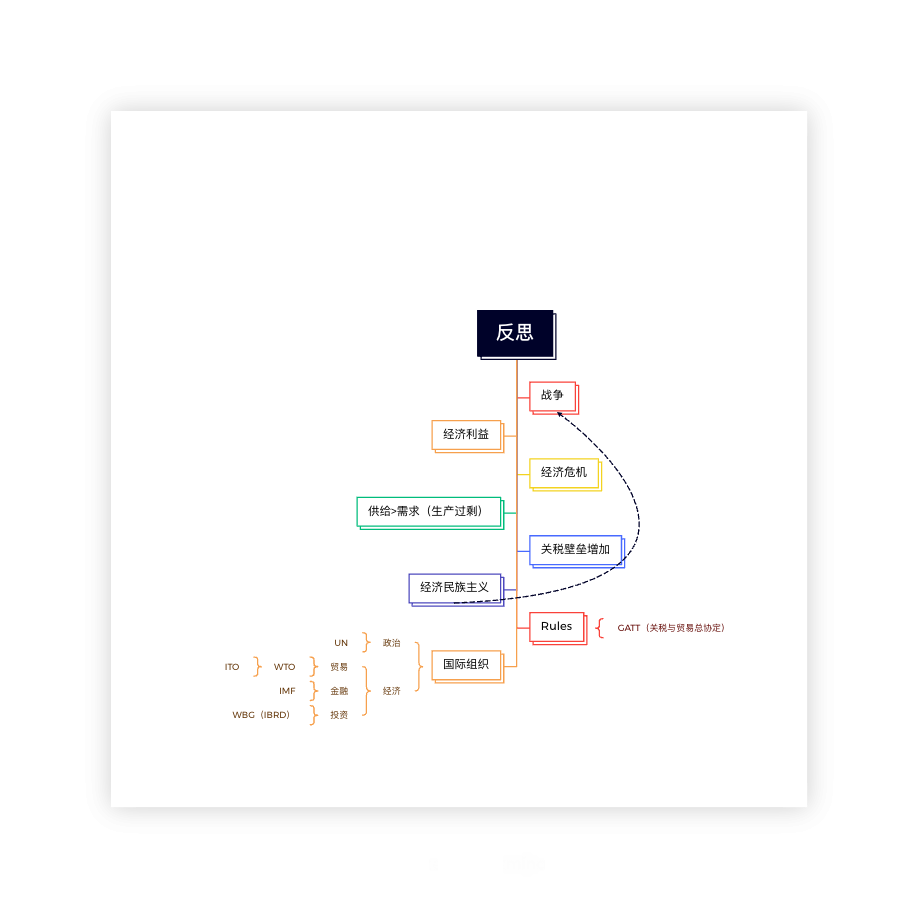

## 绪论
### 国际经济学的产生
1. 战后国际组织的建立
2. 战后西方国家经济发展进入黄金时期
3. 对日益膨胀的国际经济活动的研究

[UN「  United Nations」](https://baike.baidu.com/item/%E8%81%94%E5%90%88%E5%9B%BD/135426)
[WTO「World Trade Organization」](https://baike.baidu.com/item/%e4%b8%96%e7%95%8c%e8%b4%b8%e6%98%93%e7%bb%84%e7%bb%87/150837)
[IMF「International Monetary Fund」](https://baike.baidu.com/item/%E5%9B%BD%E9%99%85%E8%B4%A7%E5%B8%81%E5%9F%BA%E9%87%91%E7%BB%84%E7%BB%87?fromtitle=imf&fromid=102924&fromModule=lemma_search-box)
[WBG「The World Bank」](https://baike.baidu.com/item/%E4%B8%96%E7%95%8C%E9%93%B6%E8%A1%8C/1055632?fromModule=lemma_search-box)
[GATT「General Agreement on Tariffs and Trade」](https://baike.baidu.com/item/%E5%85%B3%E7%A8%8E%E5%8F%8A%E8%B4%B8%E6%98%93%E6%80%BB%E5%8D%8F%E5%AE%9A?fromtitle=gatt&fromid=11158817&fromModule=lemma_search-box)
